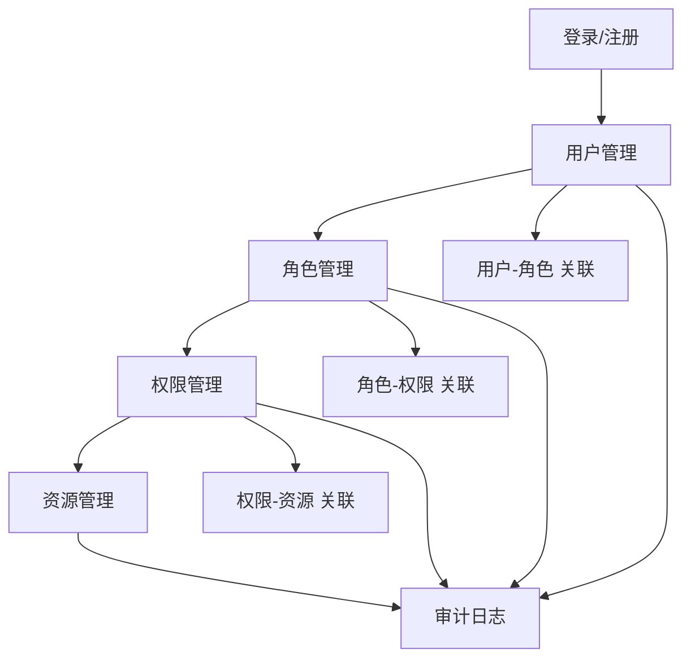

### 项目总结与说明（Permission Management System）


1. 软件功能
1.1 功能概述
本项目是一个基于控制台的人机交互权限管理系统，围绕“用户-角色-权限-资源”四要素构建，提供登录注册、用户/角色/权限/资源管理、关联关系维护以及审计日志记录等功能。系统采用分层架构（Controller-Service-DAO-Entity-Util），以 MySQL 为数据存储，遵循 UTF-8/utf8mb4 全链路编码策略，确保中文输入与存储一致。
1.2 主要功能模块
登录/注册：支持用户登录、注册（这里是为了按用户角色显示不同菜单，管理员身份用来测试整个项目的可用性，其他用户用来查看和验证自己的角色与权限。）。
用户管理：新增、删除、修改、查询用户；为用户分配角色。
角色管理：新增、删除、修改、查询角色；为角色分配权限。
权限管理：新增、删除、修改、查询权限；为权限分配资源。
资源管理：新增、删除、修改、查询资源。
权限校验：校验某个用户是否拥有某个权限或角色。
审计日志：记录关键操作（CREATE/UPDATE/DELETE/ASSIGN/QUERY）及结果。
此外，通过脚本database/init.sql创建数据库和database/test_data.sql注入基本数据以完成初始化。同时保证了编码一致性：run.bat`配置控制台与 JVM UTF-8，JDBC 连接字符串配套 UTF-8/utf8mb4。
1.3 功能组织图


2. 创新点与特色
2.1 核心创新点
全链路 UTF-8/utf8mb4 编码保证：从控制台（chcp 65001）→ JVM（Dfile.encoding=UTF-8）→ JDBC（useUnicode=true&characterEncoding=UTF-8）→ MySQL 会话与表结构（utf8mb4）一体化，确保中文姓名、说明等字段可靠存储。
四层抽象：将用户、角色、权限、资源四域模型与三张关联表构成“RBAC + 资源映射”的可扩展权限体系。
审计可追溯：对关键操作写入audit_log，便于事后审计与问题追踪。
控制台交互友好：对输入异常与中文校验进行提示，提供较好的命令行 UX。
2.2 技术栈
后端开发语言：Java 25，利用面向对象编程特性
数据库技术：MySQL 8.0.43，使用JDBC进行数据库连接和操作
数据库驱动：MySQL Connector/J (MySQL Connector/J 9.4.0)
设计模式：控制台应用 + 分层架构（Controller/Service/DAO/Entity/Util）
日志：java.util.logging封装（util/LoggerUtil.java）
依赖管理：本地 lib/引入 MySQL 驱动（无第三方框架）
设计工具：PowerDesigner（类图和时序图设计）、Mermaid（流程图和组织图绘制）

3. 设计思想（思路）
3.1 面向对象设计
每个实体类都封装了相应的属性和方法，通过接口和抽象类实现代码复用，并通过接口实现多态调用。
3.2 分层解耦
    Controller 仅处理交互与输入校验，Service 承载业务流程与事务边界，DAO 与数据库交互，Entity 纯数据结构，Util 提供基础能力（如数据库连接）。
3.3 单一职责原则
每个类聚焦一种职责，减少耦合，便于维护与扩展。例如，服务层专注于业务逻辑，DAO层专注于数据访问。
3.4 数据驱动设计
系统采用数据驱动的方式，通过数据库存储和管理所有业务数据，确保数据的一致性和完整性。
3.5 面向接口与实体建模
以“用户-角色-权限-资源 + 关联表”的 RBAC 模型为核心，支持后续横向扩展（如组织/岗位、数据权限）。

4. 设计模式的使用
4.1 分层架构模式（MVC 的变体）
分层架构模式是一种将软件系统划分为多个明确定义的、职责不同的层次的结构化设计方法。每个层次都提供一组特定的服务，并且只与它直接相邻的层次进行通信。它的核心思想是 “分离关注点” ，通过将不同的功能模块化到不同的层中，使得系统更易于理解、开发、维护和扩展。
4.2 DAO模式
每个实体都有对应的DAO类，并封装了数据库操作，提供统一的数据访问接口，隔离数据库访问细节。
4.3 模板式使用与工具抽象
数据库连接等共性能力通过util/*抽象，避免重复代码。
4.4 （可扩展）策略/工厂
权限类型（MENU/OPERATION/RESOURCE）与资源类型（MENU/BUTTON/DATA）为将来引入策略/工厂模式预留了扩展点。
 

### 5. 程序的结构或架构
```
Experiment2/
├─ database/
│  ├─ init.sql              # 数据库与表结构初始化、默认管理员
│  └─ test_data.sql         # 测试数据
├─ lib/
│  └─ mysql-connector-j-*.jar
├─ logs/                   # 日志
├─ src/main/java/
│  ├─ controller/           # 控制台交互与菜单调度
│  ├─ service/              # 业务逻辑与事务边界
│  ├─ dao/                  # 数据访问（表/视图/关联）
│  ├─ entity/               # 领域实体（User/Role/Permission/Resource/...）
│  ├─ util/                 # 工具类（数据库连接、日志工具类）
│  └─ Main.java             # 程序入口
├─ compile.bat              # 编译（UTF-8 编码）
└─ run.bat                  # 运行（控制台与 JVM 设为 UTF-8）

```

---

### 6. 程序主要执行流程图
登录到主菜单、各管理子菜单与审计链路（结合当前实现）：

```mermaid
flowchart TD
    S[启动 Main] --> L[LoginController.showLoginMenu]
    subgraph 登录与注册
      L -->|1. 登录| L1[输入用户名/密码 → AuthService.login]
      L -->|2. 注册| L2[输入用户名/密码/姓名/邮箱 → AuthService.register]
      L -->|0. 退出| X[结束程序]

      L1 -->|校验通过且启用| M[主菜单]
      L1 -->|失败(空/错误/禁用)| L

      L2 -->|成功| L[返回登录菜单提示登录]
      L2 -->|失败(重名/非法输入)| L
    end

    subgraph 主菜单与子菜单
      M --> MU[用户管理 → UserController.showMenu]
      M --> MR[角色管理 → RoleController.showMenu]
      M --> MP[权限管理 → PermissionController.showMenu]
      M --> MRS[资源管理 → ResourceController.showMenu]
      M --> MA[权限审计 → AuditController.showMenu]
      M --> ML[退出登录 → AuthService.logout → 返回登录菜单]
    end

    %% 用户管理典型链路（其他菜单同构）
    MU --> MU1[创建/查询/更新/删除/分配/移除]
    MU1 --> SVCU[UserService 编排与校验]
    SVCU --> DAOU[UserDao/RoleDao 访问]
    SVCU --> AUD[audit_log 记录（操作、目标、结果）]

    MR --> SVCR
    MP --> SVCP
    MRS --> SVCRS
    SVCR --> AUD
    SVCP --> AUD
    SVCRS --> AUD
```

执行步骤要点：
- 输入 → 控制器：读取控制台输入（UTF-8），做基本判空与中文字符校验（密码/邮箱限制）。
- 业务 → 服务层：`AuthService/UserService/...` 负责流程编排、状态判断（启用/禁用）、重复性校验等。
- 数据 → DAO 层：`UserDao/RoleDao/...` 与 MySQL 交互，使用 JDBC 完成 CRUD 与关联表维护。
- 审计 → `audit_log`：登录/注册/CRUD/分配/移除/查询均记录操作者、目标、结果与描述，失败也记入。
- 回环 → 菜单：每个子操作结束后返回相应菜单；退出登录会写入登出审计并回到登录菜单；0 退出终止程序。

---

7. 类的说明和类之间的关系
7.1 Controller 层
LoginController：登录/注册菜单与交互；读取输入（UTF-8），进行基础判空校验，调用 AuthService.login/register；登录成功返回User，失败回到登录菜单。
UserController：用户创建、查询（全部/按ID/按用户名）、更新、删除；分配/移除角色；对密码与邮箱做中文字符校验；调用UserService与RoleService；每个操作结束回到本菜单。
RoleController：角色的新增/查询/更新/删除；分配/移除权限（与 PermissionService交互）。
PermissionController：权限的新增/查询/更新/删除；分配/移除资源（与 ResourceService交互）。
ResourceController：资源的新增/查询/更新/删除。
AuditController：审计日志的查询（全部、按用户、按操作类型）；用于课堂展示溯源。
7.2 Service 层 
AuthService：登录（用户名/密码校验、用户状态检查、失败/成功审计）、注册（重名校验、字段校验、审计）；登出（写入审计）。
UserService：用户 CRUD、用户-角色关联维护；幂等与存在性检查；对输入做二次校验；对关键操作写审计。
RoleService：角色 CRUD、角色-权限关联维护；写审计。
PermissionService：权限 CRUD、权限-资源关联维护；写审计。
ResourceService：资源 CRUD；写审计。
PermissionCheckService：集中式权限/角色校验与查询（用户是否拥有某权限/角色、用户权限编码集合、用户角色集合），依赖UserRoleDao、RolePermissionDao、PermissionDao、RoleDao、UserDao；用于菜单展示、操作前置校验与审计辅助。
AuditService：审计日志查询封装（按用户、按操作类型、全部）。
7.3 DAO 层
UserDao、RoleDao、PermissionDao、ResourceDao：各表的增删改查与索引/唯一约束配合实现的存在性/唯一性保证。
UserRoleDao、RolePermissionDao、PermissionResourceDao：三张关联表的数据维护（分配/移除）。
AuditLogDao：插入与查询审计日志。
7.4 Entity 层
User、Role、Permission、Resource、AuditLog：与表结构一一对应；含状态、创建/更新时间等通用字段。
7.5 Util 层
DatabaseUtil：JDBC 连接获取、连接字符串与驱动参数统一；可扩展连接池。
LoggerUtil：java.util.logging的统一封装，按类名产生日志记录器。
7.6 分析类图

```mermaid
classDiagram
    %% 分层关系
    Controller <.. Service : 调用
    Service <.. DAO : 调用
    DAO <.. DatabaseUtil : 获取连接
    Service ..> LoggerUtil : 日志

    %% 领域模型关联（RBAC + 资源）
    User "1" -- "many" Role : user_role
    Role "1" -- "many" Permission : role_permission
    Permission "1" -- "many" Resource : permission_resource

    %% Controllers（方法省略，聚焦类间关系）
    class LoginController
    class UserController
    class RoleController
    class PermissionController
    class ResourceController
    class AuditController

    %% Services
    class AuthService{
        +User login(String username, String password)
        +User register(String username, String password, String realName, String email)
        +void logout(Integer userId)
    }
    class UserService{
        +Integer create(User user)
        +boolean update(User user)
        +boolean delete(Integer userId)
        +User getById(Integer userId)
        +List~User~ listAll()
        +boolean assignRole(Integer userId, Integer roleId)
        +boolean removeRole(Integer userId, Integer roleId)
    }
    class RoleService{
        +Integer create(Role role)
        +boolean update(Role role)
        +boolean delete(Integer roleId)
        +Role getById(Integer roleId)
        +List~Role~ listAll()
        +boolean assignPermission(Integer roleId, Integer permissionId)
        +boolean removePermission(Integer roleId, Integer permissionId)
    }
    class PermissionService{
        +Integer create(Permission permission)
        +boolean update(Permission permission)
        +boolean delete(Integer permissionId)
        +Permission getById(Integer permissionId)
        +List~Permission~ listAll()
        +boolean assignResource(Integer permissionId, Integer resourceId)
        +boolean removeResource(Integer permissionId, Integer resourceId)
    }
    class ResourceService{
        +Integer create(Resource resource)
        +boolean update(Resource resource)
        +boolean delete(Integer resourceId)
        +Resource getById(Integer resourceId)
        +List~Resource~ listAll()
    }
    class PermissionCheckService{
        +boolean hasPermission(Integer userId, String permissionCode)
        +boolean hasRole(Integer userId, Integer roleId)
        +List~String~ getUserPermissionCodes(Integer userId)
        +List~Role~ getUserRoles(Integer userId)
        +boolean userExists(Integer userId)
        +boolean permissionExists(String permissionCode)
        +boolean roleExists(Integer roleId)
    }
    class AuditService{
        +List~AuditLog~ listAll()
        +List~AuditLog~ listByUser(Integer userId)
        +List~AuditLog~ listByAction(String action)
    }

    %% DAOs
    class UserDao{
        +Integer insert(User u)
        +boolean update(User u)
        +boolean delete(Integer id)
        +User getUserById(Integer id)
        +User getUserByUsername(String username)
        +List~User~ listAll()
    }
    class RoleDao{
        +Integer insert(Role r)
        +boolean update(Role r)
        +boolean delete(Integer id)
        +Role getRoleById(Integer id)
        +List~Role~ listAll()
    }
    class PermissionDao{
        +Integer insert(Permission p)
        +boolean update(Permission p)
        +boolean delete(Integer id)
        +Permission getPermissionById(Integer id)
        +Permission getPermissionByCode(String code)
        +List~Permission~ listAll()
    }
    class ResourceDao{
        +Integer insert(Resource r)
        +boolean update(Resource r)
        +boolean delete(Integer id)
        +Resource getResourceById(Integer id)
        +List~Resource~ listAll()
    }
    class UserRoleDao{
        +List~Integer~ getRoleIdsByUserId(Integer userId)
        +boolean add(Integer userId, Integer roleId)
        +boolean remove(Integer userId, Integer roleId)
    }
    class RolePermissionDao{
        +List~Integer~ getPermissionIdsByRoleId(Integer roleId)
        +boolean add(Integer roleId, Integer permissionId)
        +boolean remove(Integer roleId, Integer permissionId)
        +boolean hasPermissionByUser(Integer userId, String permissionCode)
    }
    class PermissionResourceDao{
        +List~Integer~ getResourceIdsByPermissionId(Integer permissionId)
        +boolean add(Integer permissionId, Integer resourceId)
        +boolean remove(Integer permissionId, Integer resourceId)
    }
    class AuditLogDao{
        +Integer insert(AuditLog log)
        +List~AuditLog~ listAll()
        +List~AuditLog~ listByUser(Integer userId)
        +List~AuditLog~ listByAction(String action)
    }

    %% 工具
    class DatabaseUtil
    class LoggerUtil

    %% 依赖指向（示例）
    PermissionCheckService --> UserRoleDao
    PermissionCheckService --> RolePermissionDao
    PermissionCheckService --> PermissionDao
    PermissionCheckService --> RoleDao
    PermissionCheckService --> UserDao
    PermissionCheckService ..> LoggerUtil

    %% 实体
    class User{
        +Integer id
        +String username
        +String passwordHash
        +String realName
        +String email
        +Integer status
        +String remark
        +LocalDateTime createdAt
        +LocalDateTime updatedAt
    }
    class Role{
        +Integer id
        +String roleName
        +String roleCode
        +Integer status
        +String remark
        +LocalDateTime createdAt
        +LocalDateTime updatedAt
    }
    class Permission{
        +Integer id
        +String permissionName
        +String permissionCode
        +Integer status
        +String remark
        +LocalDateTime createdAt
        +LocalDateTime updatedAt
    }
    class Resource{
        +Integer id
        +String resourceName
        +String resourcePath
        +String resourceType
        +Integer status
        +String remark
        +LocalDateTime createdAt
        +LocalDateTime updatedAt
    }
    class AuditLog{
        +Integer id
        +Integer userId
        +String action
        +String targetType
        +Integer targetId
        +Boolean success
        +String message
        +LocalDateTime createdAt
    }
```



---

8. 核心源代码及说明
8.1 程序入口与菜单路由
```23:33:src/main/java/Main.java
public class Main {
    private static final Logger logger = LoggerUtil.getLogger(Main.class.getName());
    private static Scanner scanner;
    
    // 当前登录用户信息
    private static Integer currentUserId;
    private static String currentUsername;
    private static User currentUser;
    
    public static void main(String[] args) {
        scanner = new Scanner(new InputStreamReader(System.in, StandardCharsets.UTF_8));
```

```83:97:src/main/java/Main.java
private static void showAdminMenu() {
    System.out.println("\n========== 主菜单（管理员） ==========");
    System.out.println("当前用户: " + currentUsername + " (ID: " + currentUserId + ")");
    System.out.println("---------------------------");
    System.out.println("1. 用户管理");
    System.out.println("2. 角色管理");
    System.out.println("3. 权限管理");
    System.out.println("4. 资源管理");
    System.out.println("5. 权限校验");
    System.out.println("6. 权限审计");
    System.out.println("7. 切换账号");
    System.out.println("0. 退出系统");
```
8.2 登录与认证（LoginController / AuthService）
a)	登录控制与注册输入（controller/LoginController.java）
```14:22:src/main/java/controller/LoginController.java
public class LoginController {
    private AuthService authService = new AuthService();
    private Scanner scanner = new Scanner(new InputStreamReader(System.in, StandardCharsets.UTF_8));
    
    /**
     * 显示登录菜单
     * @return 登录成功返回User对象，失败返回null
     */
    public User showLoginMenu() {
```

```60:75:src/main/java/controller/LoginController.java
/**
 * 登录
 * @return 登录成功返回User对象，失败返回null
 */
private User login() {
    System.out.println("\n========== 用户登录 ==========");
    System.out.print("请输入用户名: ");
    String username = scanner.nextLine().trim();
    
    System.out.print("请输入密码: ");
    String password = scanner.nextLine().trim();
    
    if (username.isEmpty() || password.isEmpty()) {
        System.out.println("用户名和密码不能为空！");
        return null;
    }
```

```120:126:src/main/java/controller/LoginController.java
User user = authService.register(username, password, realName, email);
if (user != null) {
    System.out.println("\n注册成功！用户名: " + user.getUsername() + " (ID: " + user.getId() + ")");
    System.out.println("请使用新账户登录。");
} else {
    System.out.println("\n注册失败！用户名可能已存在，请尝试其他用户名。");
}
```
b)	认证服务（service/AuthService.java）
```16:20:src/main/java/service/AuthService.java
public class AuthService {
    private static final Logger logger = LoggerUtil.getLogger(AuthService.class.getName());
    private UserDao userDao = new UserDao();
    private AuditLogDao auditLogDao = new AuditLogDao();
```

```27:41:src/main/java/service/AuthService.java
public User login(String username, String password) {
    if (username == null || username.trim().isEmpty()) {
        logger.warning("登录失败: 用户名为空");
        return null;
    }
    
    if (password == null || password.trim().isEmpty()) {
        logger.warning("登录失败: 密码为空");
        return null;
    }
    
    User user = userDao.verifyUser(username.trim(), password);
    if (user != null) {
        logger.info("用户登录成功: " + username);
        auditLogDao.createAuditLog(new AuditLog(user.getId(), username, "LOGIN", "SYSTEM", 
            String.valueOf(user.getId()), "用户登录: " + username, "SUCCESS"));
        return user;
```

```61:80:src/main/java/service/AuthService.java
public User register(String username, String password, String realName, String email) {
    if (username == null || username.trim().isEmpty()) {
        logger.warning("注册失败: 用户名为空");
        return null;
    }
    
    if (password == null || password.trim().isEmpty()) {
        logger.warning("注册失败: 密码为空");
        return null;
    }
    // 密码不能包含中文字符
    if (containsChinese(password)) {
        logger.warning("注册失败: 密码包含中文字符");
        return null;
    }
    // 邮箱可为空，但若提供则不能包含中文字符
    if (email != null && !email.trim().isEmpty() && containsChinese(email)) {
        logger.warning("注册失败: 邮箱包含中文字符");
        return null;
    }
```

```127:131:src/main/java/service/AuthService.java
public void logout(Integer userId, String username) {
    logger.info("用户登出: " + username);
    auditLogDao.createAuditLog(new AuditLog(userId, username, "LOGOUT", "SYSTEM", 
        String.valueOf(userId), "用户登出: " + username, "SUCCESS"));
}
```
8.3 权限校验（PermissionCheckController / PermissionCheckService）
```16:23:src/main/java/service/PermissionCheckService.java
public class PermissionCheckService {
    private static final Logger logger = LoggerUtil.getLogger(PermissionCheckService.class.getName());
    private RolePermissionDao rolePermissionDao = new RolePermissionDao();
    private UserRoleDao userRoleDao = new UserRoleDao();
    private UserDao userDao = new UserDao();
    private PermissionDao permissionDao = new PermissionDao();
    private RoleDao roleDao = new RoleDao();
```

```30:39:src/main/java/service/PermissionCheckService.java
public boolean hasPermission(Integer userId, String permissionCode) {
    if (userId == null || permissionCode == null) {
        logger.warning("权限校验失败: 参数为空");
        return false;
    }
    
    boolean hasPermission = rolePermissionDao.hasPermissionByUser(userId, permissionCode);
    logger.info("权限校验 - 用户ID: " + userId + ", 权限编码: " + permissionCode + ", 结果: " + hasPermission);
    return hasPermission;
}
```

```12:20:src/main/java/controller/PermissionCheckController.java
public class PermissionCheckController {
    private PermissionCheckService permissionCheckService = new PermissionCheckService();
    private Scanner scanner = new Scanner(new InputStreamReader(System.in, StandardCharsets.UTF_8));
    
    /**
     * 显示权限校验菜单
     */
    public void showMenu() {
```

```66:72:src/main/java/controller/PermissionCheckController.java
boolean hasPermission = permissionCheckService.hasPermission(userId, permissionCode);
if (hasPermission) {
    System.out.println("用户ID " + userId + " 拥有权限 [" + permissionCode + "]");
} else {
    System.out.println("用户ID " + userId + " 没有权限 [" + permissionCode + "]");
}
```
8.4 业务服务层（RoleService / PermissionService / ResourceService）
a) 角色服务（service/RoleService.java）
```17:22:src/main/java/service/RoleService.java
public class RoleService {
    private static final Logger logger = LoggerUtil.getLogger(RoleService.class.getName());
    private RoleDao roleDao = new RoleDao();
    private RolePermissionDao rolePermissionDao = new RolePermissionDao();
    private AuditLogDao auditLogDao = new AuditLogDao();
```

```108:122:src/main/java/service/RoleService.java
public boolean assignPermissionToRole(Integer roleId, Integer permissionId, Integer currentUserId, String currentUsername) {
    Role role = roleDao.getRoleById(roleId);
    if (role == null) {
        logger.warning("分配权限失败: 角色不存在 - ID: " + roleId);
        auditLogDao.createAuditLog(new AuditLog(currentUserId, currentUsername, "ASSIGN", "ROLE_PERMISSION", 
            String.valueOf(roleId), "分配权限失败: 角色不存在", "FAILURE"));
        return false;
    }
    
    if (rolePermissionDao.hasPermission(roleId, permissionId)) {
        logger.warning("分配权限失败: 角色已拥有该权限 - 角色ID: " + roleId + ", 权限ID: " + permissionId);
        auditLogDao.createAuditLog(new AuditLog(currentUserId, currentUsername, "ASSIGN", "ROLE_PERMISSION", 
            String.valueOf(roleId), "分配权限失败: 角色已拥有该权限", "FAILURE"));
        return false;
    }
```
b) 权限服务（service/PermissionService.java）
```17:22:src/main/java/service/PermissionService.java
public class PermissionService {
    private static final Logger logger = LoggerUtil.getLogger(PermissionService.class.getName());
    private PermissionDao permissionDao = new PermissionDao();
    private PermissionResourceDao permissionResourceDao = new PermissionResourceDao();
    private AuditLogDao auditLogDao = new AuditLogDao();
```

```115:121:src/main/java/service/PermissionService.java
public boolean assignResourceToPermission(Integer permissionId, Integer resourceId, Integer currentUserId, String currentUsername) {
    Permission permission = permissionDao.getPermissionById(permissionId);
    if (permission == null) {
        logger.warning("分配资源失败: 权限不存在 - ID: " + permissionId);
        auditLogDao.createAuditLog(new AuditLog(currentUserId, currentUsername, "ASSIGN", "PERMISSION_RESOURCE", 
            String.valueOf(permissionId), "分配资源失败: 权限不存在", "FAILURE"));
        return false;
    }
```
c)	资源服务（service/ResourceService.java）
```16:20:src/main/java/service/ResourceService.java
public class ResourceService {
    private static final Logger logger = LoggerUtil.getLogger(ResourceService.class.getName());
    private ResourceDao resourceDao = new ResourceDao();
    private AuditLogDao auditLogDao = new AuditLogDao();
```

```74:83:src/main/java/service/ResourceService.java
public boolean updateResource(Resource resource, Integer currentUserId, String currentUsername) {
    resource.setUpdateTime(new Date());
    boolean result = resourceDao.updateResource(resource);
    if (result) {
        auditLogDao.createAuditLog(new AuditLog(currentUserId, currentUsername, "UPDATE", "RESOURCE", 
            String.valueOf(resource.getId()), "更新资源: " + resource.getResourceName(), "SUCCESS"));
    } else {
        auditLogDao.createAuditLog(new AuditLog(currentUserId, currentUsername, "UPDATE", "RESOURCE", 
            String.valueOf(resource.getId()), "更新资源失败: " + resource.getResourceName(), "FAILURE"));
    }
    return result;
}
```
8.5 数据访问层（示例DAO）
```21:38:src/main/java/dao/UserDao.java
public boolean createUser(User user) {
    String sql = "INSERT INTO user (username, password, real_name, email, status, create_time, update_time) VALUES (?, ?, ?, ?, ?, ?, ?)";
    Connection conn = null;
    PreparedStatement pstmt = null;
    
    try {
        conn = DatabaseUtil.getConnection();
        pstmt = conn.prepareStatement(sql);
        pstmt.setString(1, user.getUsername());
        pstmt.setString(2, user.getPassword());
        pstmt.setString(3, user.getRealName());
        pstmt.setString(4, user.getEmail());
        pstmt.setInt(5, user.getStatus());
        pstmt.setTimestamp(6, new Timestamp(user.getCreateTime().getTime()));
        pstmt.setTimestamp(7, new Timestamp(user.getUpdateTime().getTime()));
        
        int result = pstmt.executeUpdate();
        logger.info("创建用户: " + user.getUsername() + ", 结果: " + (result > 0 ? "成功" : "失败"));
        return result > 0;
```

```109:121:src/main/java/dao/UserDao.java
public User verifyUser(String username, String password) {
    String sql = "SELECT * FROM user WHERE username = ? AND password = ? AND status = 1";
    Connection conn = null;
    PreparedStatement pstmt = null;
    ResultSet rs = null;
    
    try {
        conn = DatabaseUtil.getConnection();
        pstmt = conn.prepareStatement(sql);
        pstmt.setString(1, username);
        pstmt.setString(2, password);
        rs = pstmt.executeQuery();
        
        if (rs.next()) {
            return mapResultSetToUser(rs);
        }
```

```236:244:src/main/java/dao/UserDao.java
private void closeResources(Connection conn, PreparedStatement pstmt, ResultSet rs) {
    try {
        if (rs != null) rs.close();
        if (pstmt != null) pstmt.close();
        if (conn != null) DatabaseUtil.closeConnection(conn);
    } catch (SQLException e) {
        logger.severe("关闭资源失败: " + e.getMessage());
        e.printStackTrace();
    }
}
```
8.6 实体与审计服务（User / AuditLog / AuditService）
```8:16:src/main/java/entity/User.java
public class User {
    private Integer id;
    private String username;
    private String password;
    private String realName;
    private String email;
    private Date createTime;
    private Date updateTime;
    private Integer status; // 0-禁用, 1-启用
```

```21:29:src/main/java/entity/User.java
public User(String username, String password, String realName, String email) {
    this.username = username;
    this.password = password;
    this.realName = realName;
    this.email = email;
    this.status = 1; // 默认启用
    this.createTime = new Date();
    this.updateTime = new Date();
}
```
- 审计日志：DAO、服务与实体（`dao/AuditLogDao.java`、`service/AuditService.java`、`entity/AuditLog.java`）

```21:39:src/main/java/dao/AuditLogDao.java
public boolean createAuditLog(AuditLog auditLog) {
    String sql = "INSERT INTO audit_log (user_id, username, operation, target_type, target_id, description, result, create_time) VALUES (?, ?, ?, ?, ?, ?, ?, ?)";
    Connection conn = null;
    PreparedStatement pstmt = null;
    
    try {
        conn = DatabaseUtil.getConnection();
        pstmt = conn.prepareStatement(sql);
        pstmt.setObject(1, auditLog.getUserId());
        pstmt.setString(2, auditLog.getUsername());
        pstmt.setString(3, auditLog.getOperation());
        pstmt.setString(4, auditLog.getTargetType());
        pstmt.setString(5, auditLog.getTargetId());
        pstmt.setString(6, auditLog.getDescription());
        pstmt.setString(7, auditLog.getResult());
        pstmt.setTimestamp(8, new Timestamp(auditLog.getCreateTime().getTime()));
        
        int result = pstmt.executeUpdate();
        logger.info("创建审计日志: " + auditLog.getDescription() + ", 结果: " + (result > 0 ? "成功" : "失败"));
        return result > 0;
```

```11:19:src/main/java/service/AuditService.java
public class AuditService {
    private AuditLogDao auditLogDao = new AuditLogDao();
    
    /**
     * 查询所有审计日志
     */
    public List<AuditLog> getAllAuditLogs() {
        return auditLogDao.getAllAuditLogs();
    }
```

```22:31:src/main/java/entity/AuditLog.java
public AuditLog(Integer userId, String username, String operation, String targetType, String targetId, String description, String result) {
    this.userId = userId;
    this.username = username;
    this.operation = operation;
    this.targetType = targetType;
    this.targetId = targetId;
    this.description = description;
    this.result = result;
    this.createTime = new Date();
}
```
8.7 数据库与工具（DatabaseUtil）
```32:45:src/main/java/util/DatabaseUtil.java
public static Connection getConnection() {
    Connection conn = null;
    try {
        Class.forName(DRIVER);
        conn = DriverManager.getConnection(URL, USERNAME, PASSWORD);
        // 设置会话字符集为utf8mb4，确保正确处理中文
        try (java.sql.Statement stmt = conn.createStatement()) {
            stmt.execute("SET NAMES 'utf8mb4' COLLATE 'utf8mb4_unicode_ci'");
            stmt.execute("SET CHARACTER SET utf8mb4");
            stmt.execute("SET character_set_connection=utf8mb4");
            stmt.execute("SET character_set_results=utf8mb4");
            stmt.execute("SET character_set_client=utf8mb4");
        }
        logger.info("数据库连接成功");
    } catch (ClassNotFoundException e) {
        logger.severe("MySQL驱动未找到: " + e.getMessage());
        e.printStackTrace();
    } catch (SQLException e) {
        logger.severe("数据库连接失败: " + e.getMessage());
        e.printStackTrace();
    }
    return conn;
}
```


### 9. 人工智能应用情况
本系统在开发过程中充分引入了 AI 辅助编程工具，包括 ChatGPT 5、VS Code Copilot（Claude 4）以及在 Cursor 环境中的基于 GPT 的编码助手。通过 ChatGPT 5，项目快速产出了分层架构的程序包结构与基础模板，并在数据库表结构建模与文档说明撰写方面提供了高效支持。借助 Copilot（Claude 4），在具体编码阶段获得了连续性代码补全与注释生成能力，同时对编译错误进行定位与修复，显著提升了实现与调试效率。

在文档与规范层面，AI 工具协助生成并多轮迭代了本说明文档（含结构化章节与配套图示），并就编码规范、异常处理策略以及中文输入校验等提出改进建议；对 SQL 与运行脚本进行了连贯性与一致性检查，推动了配置与编码的端到端统一。结合这些建议，项目补充与完善了 RBAC 表结构设计要点，输出了较为系统化的架构图与流程图。

综合效果体现在两个方面：其一，UTF-8/utf8mb4 的全链路一致性得到压实，中文输入/显示问题具备清晰可复用的排查与修复路径；其二，项目文档与实现协同推进，形成了便于课堂/验收展示及后续扩展维护的工程化成果。

---

### 10. 其他
本部分补充项目的元信息与运行环境、入口脚本、数据库初始化、编码配置、目录定位、术语说明以及已知限制。项目采用 JDK 25、MySQL 8.0.43 与 MySQL Connector/J 9.4.0，在 Windows 10 环境下构建运行并保证控制台为 UTF-8。程序入口为 `src/main/java/Main.java`，通过 `compile.bat` 完成编译、`run.bat` 完成运行，二者均已按 UTF-8 进行配置。数据库初始化由 `database/init.sql` 完成建表与默认管理员创建，`database/test_data.sql` 提供测试数据。编码与字符集方面采用控制台 `chcp 65001`、JVM 参数 `-Dfile.encoding=UTF-8`、JDBC `useUnicode=true&characterEncoding=UTF-8`，并在会话层执行 `SET NAMES utf8mb4` 等设置以保证端到端一致。

源码位于 `src/main/java/` 并按分层架构组织于 `controller`、`service`、`dao`、`entity`、`util` 目录，依赖驱动位于 `lib/`，日志输出至 `logs/`。文中涉及的主要术语与缩写包括 RBAC（基于角色的访问控制）、DAO（数据访问对象）、UTF-8/utf8mb4（字符编码）与 JDBC（Java 数据库连接）。当前实现的已知限制与注意事项包括密码以明文存储、尚未引入事务与统一异常边界、以控制台交互为主；注册流程要求密码不得包含中文字符，邮箱字段可为空但若填写不得包含中文字符。


